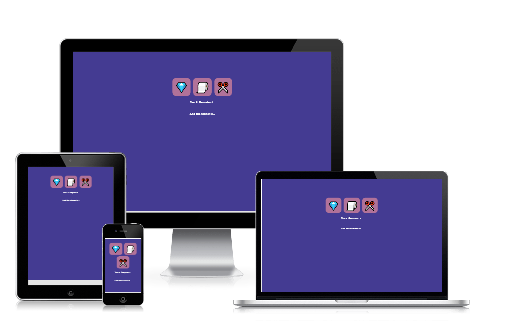

 **About this project
 This project is about the classical rock-paper-scissor game and in this case, the user plays against the computer and can see if there is a winn, loose or draw and this can be repeated as many times as the user wish.

**Wireframes
 I had used Balsamiq to create wireframes to design and organize the structure of the site.
 

 **Deployment
The site was deployed to GitHub pages. The steps to deploy are as follows: In the GitHub repository, navigate to the Settings tab From the source section drop-down menu, select the Master Branch Once the master branch has been selected, the page will be automatically refreshed with a detailed ribbon display to indicate the successful deployment. The live link can be found here - https://mariahdezg.github.io/rock-paper-scissors/

**Tests
I had the HTML tested in Validator and there. No errors were returned when passing through the official W3C for CSS. JSHint suggests that I change Javascript version, but I choose to stick to the one that have since it is functioning for this project.

No unfixed bugs left.

The test in Lighthouse that showed acceptable results. Since I only did one test that was acceptable, I just have those results:

lighthouse-test

The website had been tested with good results for responsiveness in those different media screens: Nest Hub Max, Samsung Galaxy A1/71, IPad Mini, IPhone Pro12, IPhone SE.

-mockups feature

**Features
The emoj of the rock is from [emoj of a hand making the rock gesture] (https://fontawesome.com/icons/hand-back-fist?f=classic&s=regular)

The emoj of a paper is from [emoj of a hand making the paper gesture] 
(https://fontawesome.com/icons/hand?f=classic&s=regular)

The image of a scissors  is from [emoj of a hand making the scissors gesture] (https://fontawesome.com/icons/hand-scissors?f=classic&s=regular)

**Credits: I have borrowed some codes from KristianM72 rock-paper-scissors, whos work I found in Github, but I mostly borrowed the codes from Ania Kubów´s "3 ways to code Rock Paper Scissors in JavaScript(Beginner to intermediate to Advanced!) on Youtube where I choosed the beginners level.

Footer © 2023 GitHub, Inc. Footer navigation Terms Privacy Security Status Docs Contact GitHub Pricing API Training Blog About